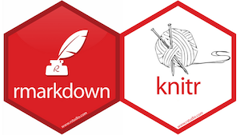

# [Data Summer Camp   Putting it all together with Knitr, LaTeX, and R Markdown](https://www.linguisticsociety.org/content/2019-annual-meeting-satellite-workshop-tools-reproducible-research-linguistics) 

## Basics
* **Date:**	Wednesday, July 10, 2019
* **Time:** 10:00 AM - 12:00 PM 
* **Location:** Olson Hall 207

## Instructors
* [**Bradley McDonnell**](http://www.bradleymcdonnell.org), University of Hawai‘i at Mānoa (<mcdonn@hawaii.edu>)
* **Bradley Rentz**, University of Hawai‘i at Mānoa (<rentzb@hawaii.edu>) 

## Materials, Software
Participants will be required to bring laptop computers to the workshop running OS-X (Mac) or Windows (mobile systems such as iPads, Android tablets, and Chromebooks are not suitable for the workshop). **Prior to the workshop, please follow these [instructions for installing all of the necessary software](installation.md), which include R, R Studio, and (optionally) LaTeX.** 

## Dynamic documents with R Markdown

These [slides](https://mcdonn.github.io/2019-lsa-dynamic-docs/dynamic_docs.html) summarize the basics of dynamic documents with R Markdown. For a fuller discussion, see [Yui Xie's description of *knitr*](https://yihui.name/knitr/). Also, see below for several helpful links.

 
 
 
 

## Exercises 
These exercises contain some sample data from a typological study, a phonetics study, and a study of language attitudes. The exercises purposely use rather simple R code. The goal of the exercises is for you to feel comfortable using dynamic documents with `knitr` with R Markdown or LaTeX.

There are two ways to download the materials for the exercises in class: 

1. If you are familiar with git and GitHub, you can simply clone this repo in R Studio. 
2. If option 1 does not make sense to you, follow the following steps: 

   - Click the green button above.  
   - Then, click Download Zip.  
   - Unzip the file and save the folder "2019-lsa-dynamic-docs-master" in an easy-to-find location.
   - Open the file "2019-lsa-dynamic-docs.Rproj" by clicking it or in R Studio selecting "File > Open Project..." and navigating to "2019-lsa-dynamic-docs.Rproj".

### Please install the following packages: 

`install.packages("tidyverse", "knitr", "kableExtra", "leaflet", "wesanderson")`

### Please take a look at...  

- [This handy cheatsheet for R Markdown](https://www.rstudio.com/wp-content/uploads/2016/03/rmarkdown-cheatsheet-2.0.pdf) 
- [This handy reference guide](https://www.rstudio.com/wp-content/uploads/2015/03/rmarkdown-reference.pdf)

*If you'd like a more information to reference have a look at [The Definitive Guide to R Markdown](https://bookdown.org/yihui/rmarkdown/)

*If you're feeling a bit confused or intimadated by all of this, feel free to take some time to look over [this very gentle introduction to R Markdown](https://rmarkdown.rstudio.com/lesson-1.html) *or* [this other short introduction](https://kbroman.org/knitr_knutshell/pages/Rmarkdown.html)

## Exercise 1: Basics of R Markdown
This is a very basic exercise to get you familiar with R Markdown. 

## Exercise 2: Typology of causatives and applicatives slide
This is a very basic example of slides using `knitr` and R Markdown. First, use the `knit` command to compile the document. Then, read through the document and look out for commented sections in between \<!-- and -->. For each of these, we list different tasks to complete throughout the document. We'll be walking around to help you complete these tasks.

## Exercise 3: Besemah stress paper
This is a basic example of a dynamic document. First, use the `knit` command to compile the document. Then, read through the document and look out for commented sections in between \<!-- and -->. For each of these, we list different tasks to complete throughout the document. We'll be walking around to help you complete these tasks. 

## Exercise 4: Language Attitudes
This is a more advanced example of a dynamic document. We'll be walking around to help you complete these tasks. 

<!--
## Exercise 3: Slides in xaringan
Another package worth looking into is [xaringan](https://github.com/yihui/xaringan). It is based upon reveal.js. 

- Install it by running `install.packages(xaringan)`. 
- Click File... > New File > R Markdown...
- Click From template in the left pane 
- Select ninja presentation and then OK.
- The template file explains all of the formatting styles in xaringan. Try it out, and even try to repoduce the slides from Exercise 2 in xaringan. 
-->

<!--

## Exercise 5: Experimenting on your own
If you have additional time, you can *either* create slides from the document in **Exercise 1** *or* create a document from the slides in **Exercise 2**. I provide a number of links at the end of exercise 2 for you to get some ideas of how you can do even more with dynamic documents.
-->

## Support

 

This material is based upon work supported by the National Science Foundation under grant SMA-1745249 to the University of Hawai‘i at Mānoa. Any opinions, findings, and conclusions or recommendations expressed in this material are those of the author(s) and do not necessarily reflect the views of the National Science Foundation.